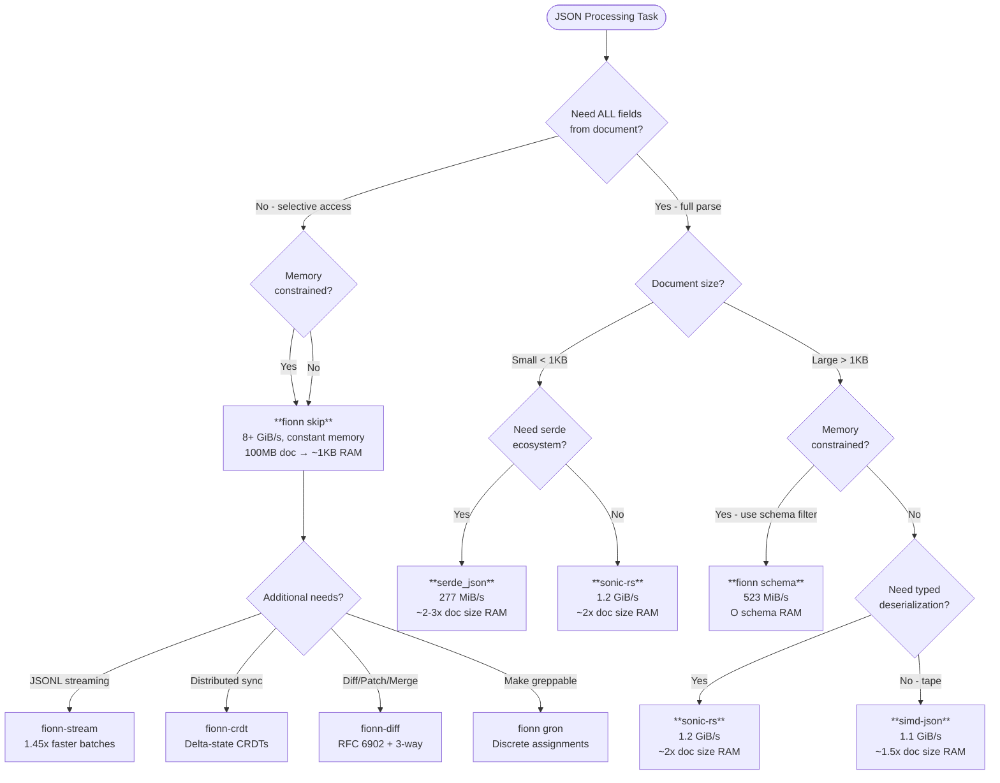

# fionn

<p align="center">
  
</p>

[](https://github.com/darach/fionn/actions/workflows/ci.yml)
[](https://coveralls.io/github/darach/fionn?branch=main)
[](https://crates.io/crates/fionn)
[](https://docs.rs/fionn)
[](https://github.com/darach/fionn#license)
[](https://github.com/darach/fionn)
[](https://scorecard.dev/viewer/?uri=github.com/darach/fionn)

> "Ever tried. Ever failed. No matter. Try again. Fail again. Fail better." — Samuel Beckett

A Swiss Army knife for JSON processing, featuring SIMD acceleration, schema inference, diff/patch/merge, and more.

Named after Fionn mac Cumhaill, the legendary Irish warrior who gained all-knowledge from the Salmon of Knowledge.

## Status

The `fionn` repo, the code, and any insights are **experimental** and have not been fully
confirmed formally or through production adoption. Although the results look good and
seem to reflect a worthwhile form of selective parsing for high volume streaming this
has yet to be fully confirmed for fionn.

However, hopefully, the approach and results are useful to others

## When to Use fionn

fionn excels when you **don't need to parse everything** or **can't afford DOM memory overhead**. Its SIMD skip operations achieve **8+ GiB/s** throughput—**29.5x faster** than serde_json—while using **O(1) memory** instead of O(document size).

### Speed vs Memory Decision



### Memory Comparison

DOM-based parsers allocate memory proportional to document size. fionn's skip-based model uses constant memory.

| Library | 1KB doc | 100MB doc | 1GB doc | Model |
|---------|---------|-----------|---------|-------|
| **serde_json** | ~3KB | ~300MB | ~3GB | DOM (Value enum overhead) |
| **sonic-rs** | ~2KB | ~200MB | ~2GB | DOM |
| **simd-json** | ~1.5KB | ~150MB | ~1.5GB | Tape (more compact) |
| **fionn skip** | **~1KB** | **~1KB** | **~1KB** | O(1) - no DOM |
| **fionn schema** | **~1KB** | **~10KB** | **~10KB** | O(schema) - only extracted fields |

**fionn processes a 1GB document using 100,000× less memory than DOM parsers.**

### Quick Comparison

| Library | Best For | Throughput | Memory | Trade-off |
|---------|----------|------------|--------|-----------|
| **fionn** | Skip unwanted data | **8+ GiB/s** | **O(1)** | Skip-based model |
| **sonic-rs** | Full parse, any size | 1.2 GiB/s | O(n) | Newer, less battle-tested |
| **simd-json** | Full parse, large docs | 1.1 GiB/s | O(n) | Tape API learning curve |
| **serde_json** | Ecosystem, small docs | 277 MiB/s | O(n) | Slower on large docs |

### The Skip Advantage

When processing a 253KB API response with 1000 users:

```
                          Time      Throughput    Memory Used
serde_json (full parse):  913 µs    277 MiB/s     ~750 KB (DOM)
sonic-rs (full parse):    195 µs    1.26 GiB/s    ~500 KB (DOM)
fionn AVX2 (skip):         31 µs    8.0 GiB/s     ~1 KB (no DOM)
```

**fionn is 29.5x faster AND uses 500x less memory.**

If you only need 3 fields from 50, why parse all 50? Why allocate memory for data you'll discard?

## Features

- **SIMD Skip**: Traverse JSON at 8+ GiB/s without building a DOM (AVX2, AVX-512)
- **DOMless Processing**: O(schema) memory - process 1GB docs with KB of RAM
- **Zero-Copy APIs**: Gron and Diff operations without intermediate allocations
- **Memory Pooling**: Reusable buffers with LRU/size-limited eviction strategies
- **JSONL Streaming**: Schema-filtered batch processing, 1.45x faster than line-by-line
- **Gron**: Make JSON greppable - transform to discrete assignments
- **Diff/Patch/Merge**: RFC 6902 JSON Patch, 3-way merge with CRDT support
- **Schema Inference**: Automatically infer schemas from JSON samples
- **CRDT Sync**: Delta-state CRDTs for distributed JSON synchronization
- **Query Language**: jq-like expressions for filtering and transformation
- **Format Conversion**: JSON, YAML, TOML, CSV interconversion

## Installation

```bash
cargo install fionn
```

Or add to your project:

```toml
[dependencies]
fionn = "0.1"
fionn-simd = "0.1"  # For skip operations
fionn-stream = "0.1"  # For JSONL streaming
```

## Quick Start

### CLI Usage

```bash
# Make JSON greppable
fionn data.json

# Ungron - convert back to JSON
fionn -u gronned.txt

# Query with JSONPath-like syntax
fionn -q '.users[*].name' data.json

# Process JSONL (newline-delimited JSON)
fionn --jsonl large_dataset.jsonl

# Colorized output
fionn --color data.json
```

### Library Usage

```rust
use fionn_simd::{Avx2Skip, Skip};

// Skip an entire JSON object at 8+ GiB/s
let json = br#"{"users": [...thousands of users...], "metadata": {...}}"#;
let skip = Avx2Skip::new();

// Skip from after opening brace - finds closing } without parsing contents
let result = skip.skip_object(&json[1..]);
println!("Skipped {} bytes", result.unwrap().consumed);
```

```rust
use fionn_stream::skiptape::{CompiledSchema, jsonl::SimdJsonlBatchProcessor};

// Process JSONL with schema filtering
let schema = CompiledSchema::compile(&["id".into(), "name".into()]).unwrap();
let mut processor = SimdJsonlBatchProcessor::new();

// Only extracts id and name fields - skips everything else
let results = processor.process_batch_optimized(jsonl_data, &schema).unwrap();
```

## Architecture

```
fionn (umbrella crate)
├── fionn-simd     # SIMD skip operations (AVX2, Scalar, JsonSki, Langdale)
├── fionn-stream   # JSONL streaming with schema filtering
├── fionn-tape     # Tape-based JSON representation
├── fionn-ops      # BlackBox processor, schema filtering
├── fionn-crdt     # Delta-state CRDTs for distributed sync
├── fionn-diff     # JSON diff/patch (RFC 6902)
├── fionn-gron     # Make JSON greppable
├── fionn-pool     # Memory pooling for zero-allocation processing
└── fionn-cli      # Command-line interface
```

## Skip Strategies

fionn provides multiple skip implementations for different scenarios:

| Strategy | Throughput | Best For |
|----------|------------|----------|
| **AVX2** | 4-8 GiB/s | x86_64 with AVX2 support |
| **JsonSki** | 1.0 GiB/s | Portable, good default |
| **Langdale** | 987 MiB/s | Escape-heavy content |
| **Scalar** | 1.5 GiB/s | Baseline, always available |

```rust
use fionn_simd::{SkipStrategy, Skip};

// Auto-select best available
let strategy = SkipStrategy::best_simd();
let skipper = strategy.skipper();
let result = skipper.skip_object(json_bytes);
```

## Building

```bash
# Debug build
cargo build

# Release build with native CPU optimizations
RUSTFLAGS="-C target-cpu=native" cargo build --release

# Run tests
cargo test

# Run benchmarks
cargo bench --bench schema_selectivity
```

## Requirements

- Rust 1.89+ (Edition 2024)
- For AVX2 skip: x86_64 CPU with AVX2 (Haswell+, 2013)
- For AVX-512 skip: x86_64 CPU with AVX-512BW (Skylake-X+, 2017)

## Benchmarks

See [docs/performance/summary.md](docs/performance/summary.md) for detailed benchmarks.

Key results on a typical workload (253KB JSON, 1000 records):

| Operation | Time | Throughput |
|-----------|------|------------|
| fionn AVX2 skip | 31 µs | 8.0 GiB/s |
| fionn JSONL batch | 202 µs | 523 MiB/s |
| sonic-rs full parse | 195 µs | 1.26 GiB/s |
| serde_json full parse | 913 µs | 277 MiB/s |

## License

Licensed under either of:

- Apache License, Version 2.0 ([LICENSE-APACHE](LICENSE-APACHE) or http://www.apache.org/licenses/LICENSE-2.0)
- MIT License ([LICENSE-MIT](LICENSE-MIT) or http://opensource.org/licenses/MIT)

at your option.

## Contributing

Contributions are welcome! Please read [CONTRIBUTING.md](CONTRIBUTING.md) for guidelines.

## Security

To report security vulnerabilities, please see [SECURITY.md](SECURITY.md).
