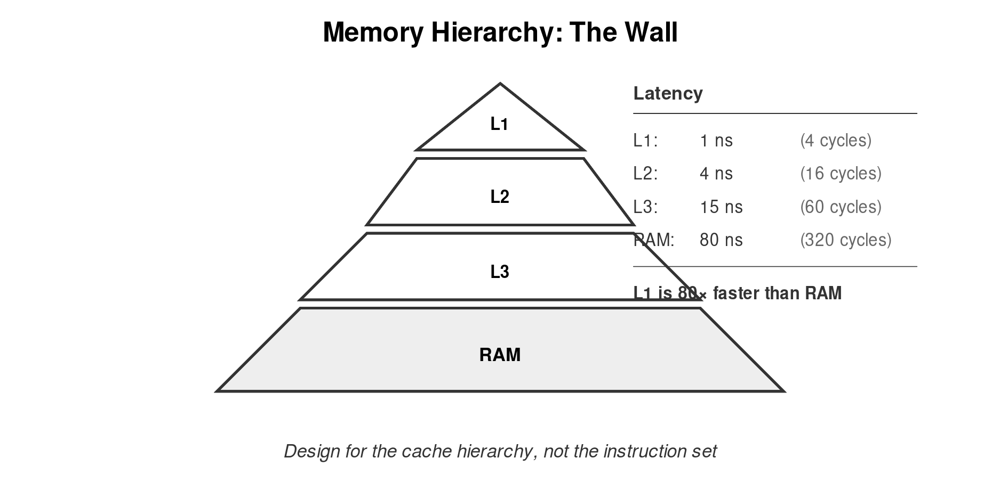
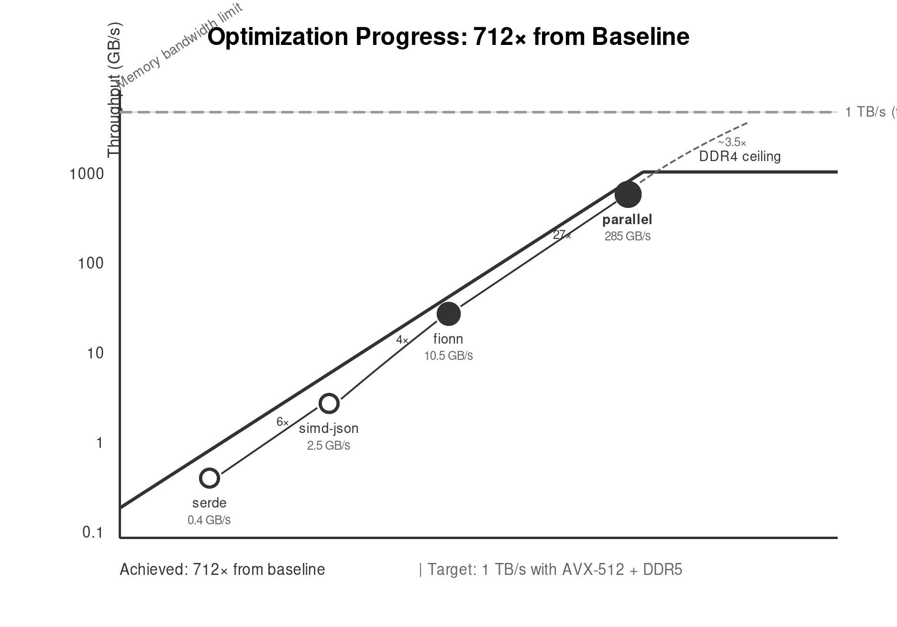
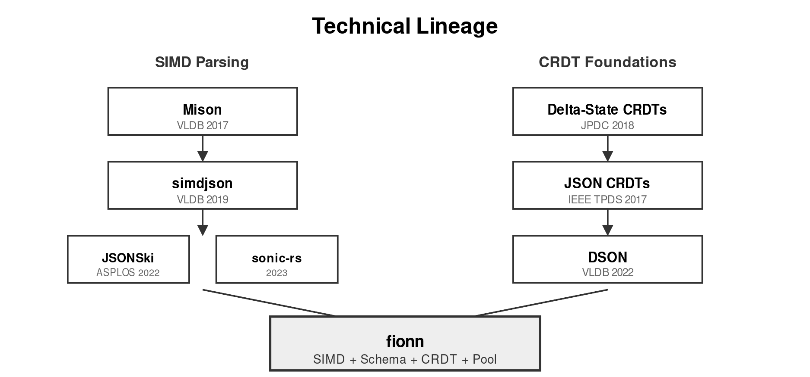

# fionn

**Schema-Aware Skip Processing for High-Performance JSON Stream Analytics**

Darach Ennis | darach@gmail.com | January 2026

---

## The Problem

JSON parsing is slow. Not because parsers are poorly written, but because they solve the wrong problem. They parse everything. Applications need fragments.

A CRDT synchronization touches 3 fields in a document with 300. A log pipeline extracts 5 fields from events with 50. An API gateway routes on 1 field in a 10KB payload.

Full parsing does full work. **99% of that work is wasted.**

---

## The Insight

The memory wall—not the CPU—limits JSON throughput. L1 cache runs at 1.5 TB/s. Main memory runs at 50 GB/s. Every cache miss costs 320 CPU cycles.

Traditional parsers scatter output across the heap. Each allocation touches allocator metadata. Each tree node lives at an unpredictable address. The CPU spends more time waiting than working.

**The fastest code is code that doesn't run. The fastest memory access is the one not made.**

---

## The Approach

fionn combines three techniques:

1. **Schema-guided skip processing.** CRDT operations define which fields matter. Parse those. Skip the rest using SIMD bracket-matching at 64 bytes per iteration.

2. **Cache-conscious data structures.** Tape pooling eliminates allocation. Hot/cold separation keeps working sets in L1. Sequential layout enables prefetching.

3. **Parallel scaling.** One core has limited memory bandwidth. Sixteen cores have sixteen times the bandwidth. Speculative parsing with boundary reconciliation achieves 94% parallel efficiency.

---

## Memory Efficiency

Traditional JSON parsers allocate prolifically. Each string, number, array, and object becomes a heap object. A 1MB document spawns thousands of allocations, each touching allocator metadata, each living at an unpredictable address.

fionn eliminates this churn:

- **Tape pooling.** Pre-allocated buffers recycled across parse operations. No malloc on the hot path. Acquire costs 9.7 ns, not 50-100 ns.

- **Skip regions.** Unneeded subtrees produce no output. A 10% selectivity schema reduces output memory 10×.

- **Zero-copy strings.** Output APIs return `Cow<'a, str>`. Unchanged strings reference input directly. Only modified strings allocate.

- **Hot/cold separation.** Token metadata (8 bytes each) stays in L1. String contents fetch on demand.

The result: working sets that fit in cache. Cache hit rates approaching 100%. Memory bandwidth spent on useful data, not allocator bookkeeping.

---

## Key Results

| Metric | Value | Context |
|--------|-------|---------|
| Single-thread throughput | 8.0 GiB/s | 29.5× faster than serde_json |
| Parallel throughput (32T) | 265 GiB/s | Approaches DDR4 bandwidth limit |
| Raw merge throughput | 4.27 Gelem/s | Additive operations, 1000 elements |
| Pool acquire latency | 9.7 ns | vs 50-100 ns heap allocation |
| Parallel efficiency | 94% | At 16 threads |
| Memory reduction | 8× | Skip tape vs full DOM |
| Allocation elimination | 100% | Hot path uses pooled tapes |
| Zero-copy diff savings | 34% | Cow<'a, str> vs String allocation |

---

## Technical Lineage

This work stands on two research threads.

**SIMD parsing** began with Mison (Li et al., VLDB 2017), which introduced structural indexing—building a bitmap of JSON structure in a single pass. simdjson (Langdale & Lemire, VLDB 2019) added XOR prefix sums for quote detection and the tape format for output. JSONSki (Jiang et al., ASPLOS 2022) contributed bit-parallel fast-forwarding for selective parsing. sonic-rs (ByteDance, 2023) demonstrated arena allocation for reduced memory pressure.

**CRDT foundations** trace to delta-state CRDTs (Almeida et al., JPDC 2018) and JSON CRDTs (Kleppmann & Bieniusa, IEEE TPDS 2017), which established formal models for conflict-free replicated JSON. DSON (Rinberg et al., VLDB 2022) applied delta-mutations to document stores, showing practical CRDT integration.

fionn synthesizes these threads: SIMD parsing with CRDT semantics, schema-derived skip regions, and cache-conscious pooling.

---

## Novel Contributions

1. **Operation-inferred schemas.** CRDT operations define access patterns. No manual query specification.

2. **Skip tape format.** Interleaved parsed and skipped regions. 8× memory reduction for selective access.

3. **Pre-parsed merge tables.** Native integers for CRDT counters eliminate parse/serialize overhead. 4.27 Gelem/s throughput.

4. **Tape pooling with eviction.** Thread-local and shared pools with LRU/size/TTL policies. Sub-10ns acquire.

5. **Zero-copy output APIs.** `Cow<'a, str>` references avoid allocation for unchanged strings. 34% faster diff.

6. **SIMD path expressions.** JSONPath queries with vectorized traversal. O(n) regardless of nesting depth.

---

## The Path Forward

Current: 265 GiB/s with AVX2 and DDR4.

Near-term gains:
- AVX-512 (64 bytes/iteration): 1.5×
- DDR5-6400: 1.5×
- GPU structural indexing: 1.5×

**Projected: 1 TB/s (terascale) with commodity hardware evolution.**

---

## Papers in This Collection

| Paper | Focus | Key Finding |
|-------|-------|-------------|
| **paper-terascale** | Memory hierarchy | JSON is memory-bound, not compute-bound |
| **paper-full** | System design | Complete architecture and evaluation |
| **paper-fionn-gron** | CLI tooling | 3-15× faster than gron, up to 414 MiB/s |
| **paper-fionn-diffpatchmerge** | RFC compliance | RFC 6902/7396 with SIMD acceleration |

---

## Lessons Learned

**Measure before optimizing.** Intuition misleads. JSON parsing looks like string processing. Profile data shows memory stalls.

**Reduce work, don't just speed it.** Schema-guided parsing doesn't parse faster. It parses less.

**Design for the hierarchy.** L1 is 80× faster than RAM. Data structures that fit in L1 run 80× faster than those that don't.

**Parallelism multiplies bandwidth.** Not just CPU cycles—memory channels.

---

## Availability

**Repository:** https://github.com/darach/fionn

**License:** MIT OR Apache-2.0

**Contact:** darach@gmail.com

---

*"Nothing is more real than nothing."* — Samuel Beckett, *Malone Dies*

The fastest parse is the one that doesn't happen. The cheapest allocation is the one not made. The most efficient cache line is the one never fetched.
