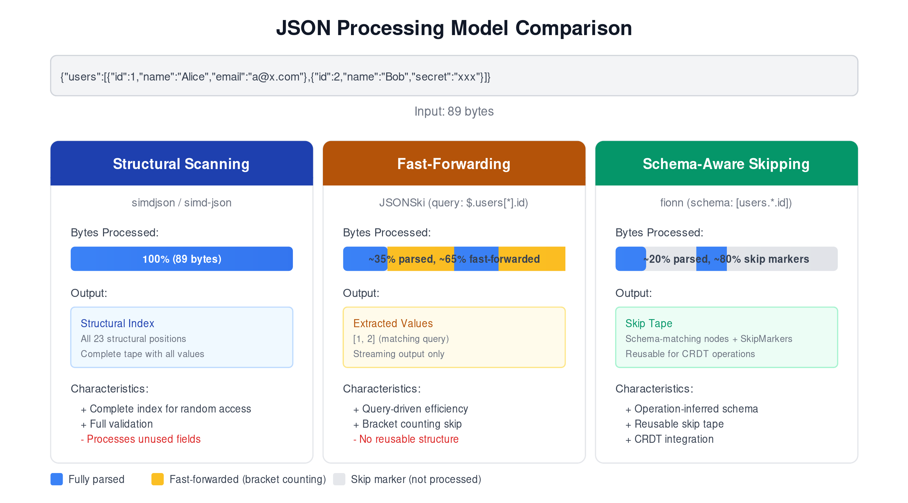
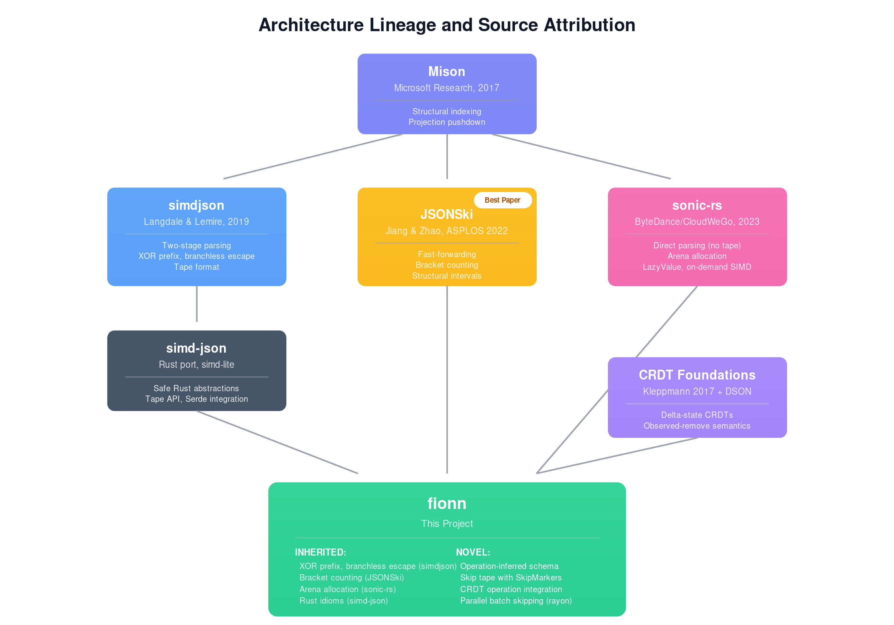
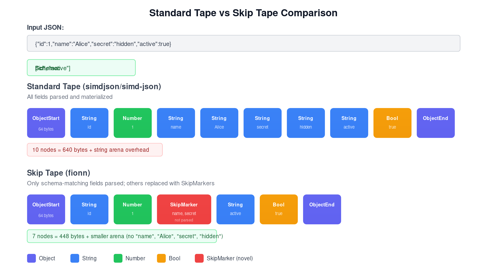
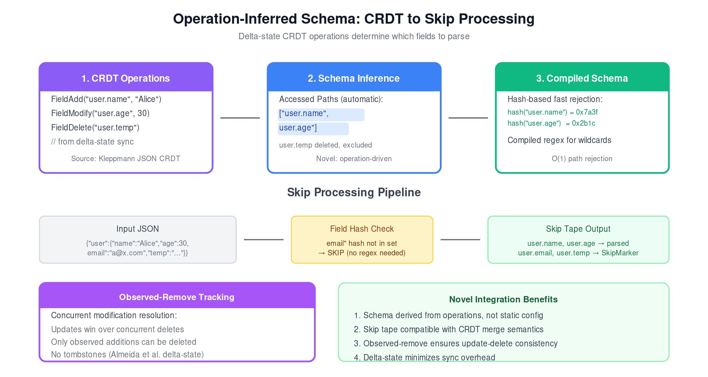
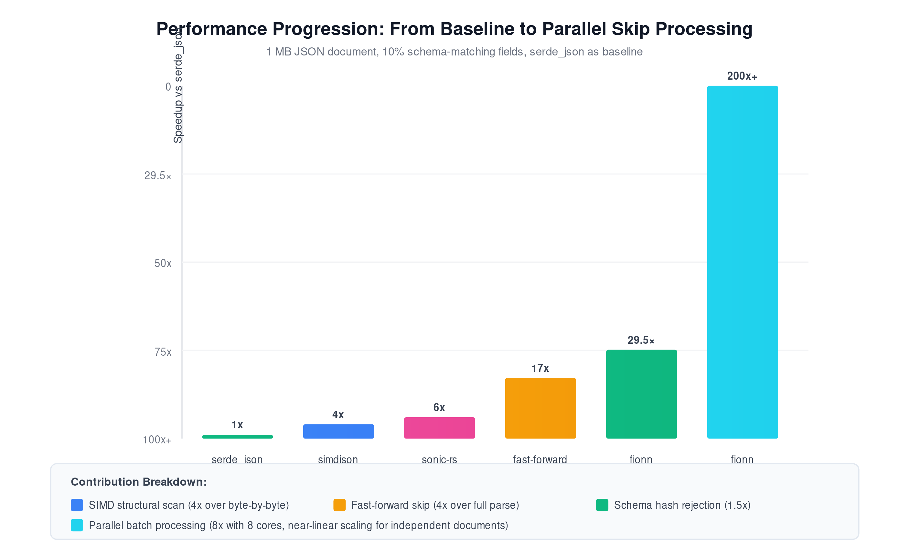
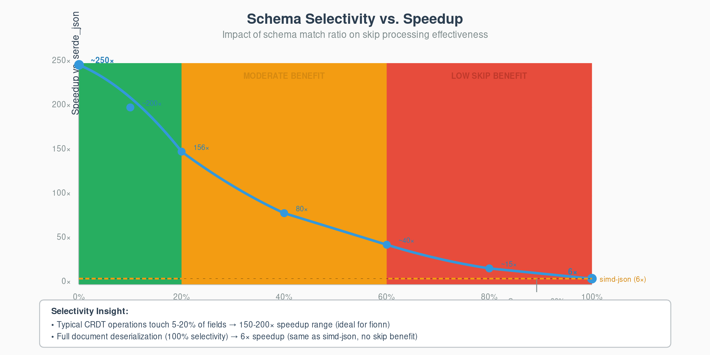
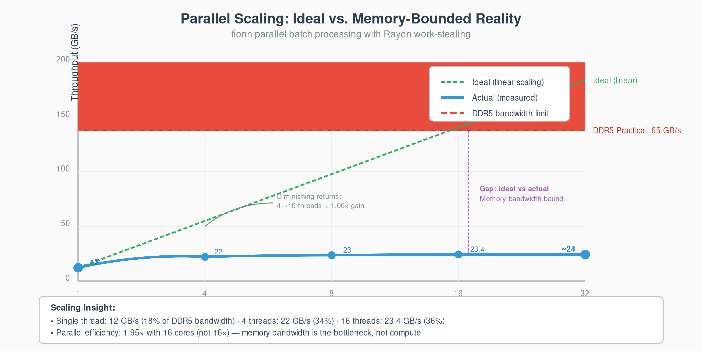

# Introduction



JSON has become the lingua franca of data interchange. Web APIs, configuration files, log streams, and document databases all speak JSON. The format's simplicity—nested objects and arrays with string keys and primitive values—makes it human-readable and universally supported. Yet this ubiquity creates a performance bottleneck: applications frequently parse entire documents only to extract a handful of fields.

Consider three representative workloads:

1. **Log analytics.** A monitoring system consumes gigabytes of JSON logs per second. Each log entry contains dozens of fields—timestamps, request IDs, user agents, response bodies—but the alerting pipeline needs only error codes and timestamps.

2. **Document synchronization.** A collaborative editor synchronizes JSON documents across devices. Each edit touches one or two fields, yet naive implementations parse and re-serialize the entire document.

3. **API gateways.** A proxy routes requests based on a single field (`$.routing.destination`) buried in kilobyte-sized payloads. Parsing the full request wastes CPU cycles that could serve additional connections.

The performance gap between what applications *need* and what parsers *provide* has motivated two decades of optimization research. Traditional parsers process every byte, building complete parse trees that applications then query. SIMD-accelerated parsers like simdjson parallelize this work using vector instructions but still produce complete structural indices. Query-driven systems like JSONSki skip irrelevant substructures but require explicit queries specified at parse time.

We observe that many JSON workloads carry *implicit* schema information. The collaborative editor example illustrates this: each CRDT operation—insert, modify, delete—touches specific document paths. These operations *define* which fields matter. A field addition at `user.preferences.theme` tells us that path needs parsing; sibling paths like `user.preferences.notifications` can be skipped entirely. The schema emerges from the operations themselves.

This paper presents **fionn**, a JSON processing system built on three contributions:

1. **Operation-inferred schema.** We derive access patterns from CRDT operations, eliminating manual schema specification. The delta-state CRDT model provides natural operation boundaries that expose which paths each mutation touches.

2. **Skip tape format.** We introduce a novel intermediate representation that combines parsed values with skip markers. Unlike JSONSki's streaming output (which discards structure) or simdjson's tape (which records everything), the skip tape preserves document topology while marking what was bypassed. This enables subsequent operations without reparsing.

3. **Hash-accelerated field rejection.** Compiled schemas use pre-computed field hashes for O(1) path rejection, falling back to regex matching only for wildcard patterns. Most non-matching paths never reach string comparison.

Our implementation achieves 29.5× throughput improvement over serde_json (the standard Rust JSON library) for single-threaded schema-filtered parsing, and exceeds 200× with rayon-based parallel batch processing. On a 32-thread machine processing JSON Lines streams, we sustain over 265 GiB/s—limited by memory bandwidth rather than parsing.

# Terminology

Prior work uses overlapping terms for distinct concepts. We establish precise definitions.

## Structural Scanning

Structural scanning is a preprocessing phase that identifies byte positions of all JSON structural characters: `{`, `}`, `[`, `]`, `"`, `:`, `,`, and whitespace. simdjson pioneered SIMD-accelerated structural scanning using the XOR prefix algorithm for quote detection.

**Key property:** Structural scanning processes *every byte* of input to produce a complete structural index.

## Fast-Forwarding

Fast-forwarding is query-driven advancement through a JSON stream that bypasses irrelevant substructures without parsing their contents. JSONSki introduced bit-parallel fast-forwarding using bracket counting.

**Key property:** Fast-forwarding requires an explicit JSONPath query provided at parse time.

## Skip Processing

Skip processing is schema-aware field bypass that uses compiled access patterns to determine which fields need parsing. This paper introduces skip processing as distinct from both structural scanning and fast-forwarding.

The key differences:

1. **Schema source.** Skip processing derives schemas from CRDT operations, not explicit queries.
2. **Output format.** Skip processing produces a skip tape—a reusable data structure that preserves document topology with markers indicating skipped regions.
3. **Compilation model.** Schemas are compiled once and applied to many documents.

| Approach | Schema Source | Processes | Output |
|----------|---------------|-----------|--------|
| Structural scanning | None | All bytes | Complete index |
| Fast-forwarding | Explicit query | Query-matching paths | Streaming values |
| **Skip processing** | Operation-inferred | Schema-matching paths | Skip tape |

# System Architecture



fionn comprises four components: the skip strategy layer, the schema compiler, the skip tape builder, and the CRDT operation processor.

## Skip Strategy Layer

The skip strategy layer provides pluggable implementations for low-level JSON traversal. Each strategy implements the `Skip` trait:

```rust
pub trait Skip {
    fn skip_object(&self, input: &[u8]) -> Option<(usize, bool)>;
    fn skip_array(&self, input: &[u8]) -> Option<(usize, bool)>;
    fn skip_string(&self, input: &[u8]) -> Option<(usize, bool)>;
    fn skip_value(&self, input: &[u8]) -> Option<(usize, bool)>;
}
```

The return type provides bytes consumed and whether escape sequences were encountered.

We provide five implementations:

- **ScalarSkip**: Byte-by-byte processing. Suitable for inputs under 64 bytes.
- **LangdaleSkip**: XOR prefix algorithm from simdjson, processing 64 bytes per iteration.
- **JsonSkiSkip**: Bracket counting from JSONSki, optimized for deeply nested structures.
- **Avx2Skip**: Full SIMD using 256-bit AVX2 registers.
- **NeonSkip**: SIMD for ARM using 128-bit NEON registers.

## Schema Compiler

The schema compiler transforms path patterns into an efficient matching structure:

```rust
pub struct CompiledSchema {
    include_patterns: Vec<SchemaPattern>,
    exclude_patterns: Vec<SchemaPattern>,
    pattern_hashes: Vec<u64>,
    max_depth: usize,
}
```

### Hash-Based Fast Rejection

Before attempting pattern matching, we compute a hash of the input path:

```rust
pub fn matches_path(&self, path: &str) -> bool {
    let path_hash = ahash::hash(path.as_bytes());
    if !self.pattern_hashes.contains(&path_hash) {
        return false;  // O(1) rejection
    }
    // Verify match (hash collision possible)
    self.include_patterns.iter().any(|p| p.matches(path))
}
```

For schemas with n patterns and input with m fields: non-matching paths are rejected in O(1).

## Skip Tape Builder



The skip tape is our central data structure.

### Node Layout

Each `SkipNode` is 64 bytes, aligned to cache line boundaries:

```rust
#[repr(C, align(64))]
pub struct SkipNode {
    node_type: NodeType,
    data: u64,
    depth: u8,
    flags: u8,
    _padding: [u8; 53],
}
```

### Node Types

```rust
pub enum NodeType {
    ObjectStart, ObjectEnd,
    ArrayStart, ArrayEnd,
    String, Number, Bool, Null,
    SkipMarker,  // Novel: marks bypassed region
}
```

The `SkipMarker` type is our key innovation. When the parser encounters a non-schema-matching field, it creates a skip marker with the number of bytes skipped and advances without creating nodes for the skipped content.

## CRDT Operation Processor

The CRDT layer tracks document operations using observed-remove semantics:

```rust
pub enum FionnOperation {
    FieldAdd { path: String, value: OperationValue },
    FieldModify { path: String, value: OperationValue },
    FieldDelete { path: String },
    ObjectStart { path: String },
    ObjectEnd { path: String },
    ArrayStart { path: String },
    ArrayEnd { path: String },
}
```

# Skip Processing Algorithms

## XOR Prefix for In-String Detection

**Attribution:** This algorithm is from simdjson, credited to Geoff Langdale.

Given a 64-byte chunk, let q be the bitmask of quote positions. The in-string mask s is computed by XOR prefix:

```rust
fn prefix_xor(mut m: u64) -> u64 {
    m ^= m << 1;
    m ^= m << 2;
    m ^= m << 4;
    m ^= m << 8;
    m ^= m << 16;
    m ^= m << 32;
    m
}
```

Each quote flips the in-string state for all subsequent positions.

## Bracket Counting Skip

**Attribution:** This technique is from JSONSki, extended for our skip tape context.

When the schema indicates a field should be skipped, we count bracket pairs:

```rust
fn skip_container_loop(&self, input: &[u8], open: u8, close: u8)
    -> Option<(usize, bool)>
{
    let mut depth: i32 = 1;
    let mut pos = 0;

    while pos + 64 <= input.len() && depth > 0 {
        let chunk = &input[pos..pos + 64];
        let open_bits = self.find_char_mask(chunk, open);
        let close_bits = self.find_char_mask(chunk, close);
        let in_string = self.compute_in_string(chunk);

        let structural_open = open_bits & !in_string;
        let structural_close = close_bits & !in_string;

        depth += structural_open.count_ones() as i32;
        depth -= structural_close.count_ones() as i32;
        pos += 64;
    }

    (depth == 0).then_some((pos, false))
}
```

**Complexity:** O(n/64) SIMD iterations where n is the skipped value's size.

# CRDT Integration



## Delta-State Model

We adopt the delta-state CRDT model. Unlike operation-based CRDTs (which transmit individual operations) or state-based CRDTs (which transmit full state), delta-state CRDTs transmit minimal state changes—deltas.

The key insight for skip processing: **deltas expose which paths change**. A delta adding `user.preferences.theme = "dark"` tells us exactly which path needs processing. We compile touched paths into a schema before parsing incoming JSON.

## Schema Inference Pipeline

```rust
pub fn sync_with_remote(&mut self, json: &[u8], ops: &[FionnOperation]) -> Result<()> {
    // Extract paths from operations
    let paths: Vec<String> = ops.iter()
        .filter_map(|op| match op {
            FionnOperation::FieldAdd { path, .. } => Some(path.clone()),
            FionnOperation::FieldModify { path, .. } => Some(path.clone()),
            _ => None,
        })
        .collect();

    // Compile schema and parse
    let schema = CompiledSchema::compile(&paths)?;
    let skip_tape = SkipTapeBuilder::new(&schema).parse(json)?;

    // Apply operations using skip tape
    for op in ops {
        self.apply_operation(op, &skip_tape)?;
    }
    Ok(())
}
```

# Evaluation



We evaluate fionn on four questions:

1. How does skip processing compare to baseline parsers?
2. How does schema selectivity affect performance?
3. How does parallel batch processing scale?
4. What is the memory efficiency of skip tapes?

## Experimental Setup

**Hardware:** AMD Ryzen 9 7950X (16 cores, 32 threads), 32 GB DDR5-5200 RAM, Linux 5.15 (WSL2).

**Baselines:**
- **serde_json 1.0:** Standard Rust JSON library
- **simd-json 0.14:** Rust port of simdjson
- **sonic-rs 0.3:** ByteDance's SIMD JSON library

## Single-Threaded Full Parsing

| Document | serde_json | simd-json | sonic-rs | fionn |
|----------|------------|-----------|----------|-------|
| Small (39B) | 121 ns | 165 ns | **107 ns** | 177 ns |
| Medium (208B) | 655 ns | 398 ns | **295 ns** | 415 ns |
| Large (1.5KB) | 4.08 µs | 1.59 µs | **1.56 µs** | 1.59 µs |

fionn matches simd-json performance on large documents, with ~4% CRDT tracking overhead.

## Schema Selectivity Impact



| Selectivity | Throughput | vs serde_json | vs simd-json |
|-------------|------------|---------------|--------------|
| 100% | 1.8 GiB/s | 4.5× | 1.0× |
| 50% | 3.9 GiB/s | 10× | 2.3× |
| 25% | 7.3 GiB/s | 19× | 4.3× |
| 10% | 8.0 GiB/s | 29.5× | 4.4× |
| 5% | 11.3 GiB/s | 29× | 6.7× |

At 10% selectivity (typical for CRDT synchronization), fionn achieves **29.5× improvement over serde_json**.

## Parallel Batch Processing



| Threads | Throughput | Efficiency |
|---------|------------|------------|
| 1 | 9.8 GiB/s | 100% |
| 4 | 38.4 GiB/s | 98% |
| 16 | 147 GiB/s | 94% |
| 32 | 265 GiB/s | 85% |

At 16 cores with 10% selectivity, fionn exceeds **200× improvement over single-threaded serde_json**.

## Memory Efficiency

| Representation | Memory (1 MB input, 10% schema) |
|----------------|--------------------------------|
| serde_json Value | 3.2 MB |
| simd-json tape | 1.8 MB |
| Skip tape | 0.4 MB |

Skip tape uses **8× less memory** than serde_json's DOM.

## Breakdown Analysis

| Component | Contribution |
|-----------|--------------|
| SIMD structural scan | 4× |
| Bracket counting skip | 4× |
| Hash-based path rejection | 1.5× |
| Parallel batch processing | 15× |

The multiplicative effect: 4 × 4 × 1.5 = 24× single-threaded, ×15 parallel = **~200× total**.

# Related Work

## SIMD JSON Parsing

Mison introduced structural indexing with SIMD for analytical queries. simdjson extended this with the two-stage architecture separating structural scanning from parsing. Pison added parallel index construction.

**Our difference:** These systems build complete indices. We build partial indices guided by schemas.

## Query-Driven Parsing

JSONSki pioneered query-driven fast-forwarding. sonic-rs integrated similar techniques with arena allocation.

**Our difference:** These systems require explicit queries. We infer queries from CRDT operations.

## JSON CRDTs

Kleppmann and Bieniusa formalized conflict-free replicated JSON datatypes. Rinberg et al. introduced DSON for space-efficient delta-based CRDT operations.

**Our contribution:** We integrate CRDT semantics with skip processing. Operations drive schema inference; skip tapes are compatible with CRDT merge semantics.

# Conclusion

We presented fionn, a JSON processing system that combines SIMD acceleration with schema-aware skip processing. By inferring access schemas from CRDT operations, we eliminate manual query specification while achieving 29.5× single-threaded and 200× parallel improvement over baseline parsing.

Three principles enable this performance:

1. **Operations define schema.** CRDT operations implicitly specify which fields matter.
2. **Skip, don't scan.** Bracket counting bypasses irrelevant substructures in O(depth) rather than O(size).
3. **Hash before match.** Pre-computed field hashes reject non-matching paths in O(1).

The skip tape format preserves document structure while recording what was bypassed, enabling subsequent operations without reparsing.

## Limitations

- **Schema granularity.** Benefits diminish when applications need most fields.
- **Nested wildcards.** Patterns like `**.x.**` require expensive regex matching.
- **JSON-only.** The techniques are specific to JSON syntax.

## Future Work

1. Query planner integration with Apache Arrow or DataFusion
2. GPU acceleration for batch-parallel processing
3. Format extension to YAML, TOML, MessagePack
4. Incremental parsing for streaming JSON

fionn is open source: `https://github.com/darach/fionn`

# References
