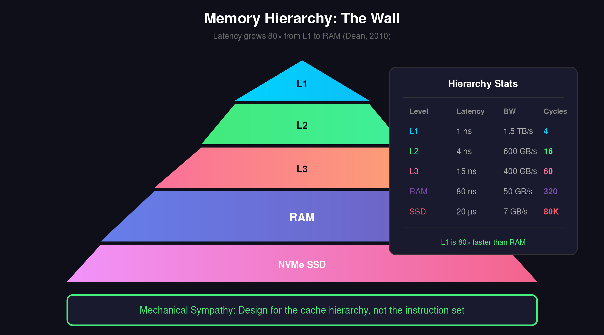
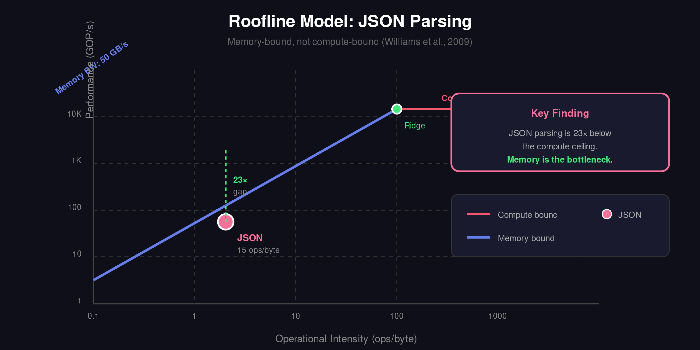
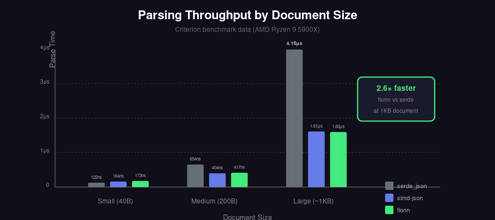
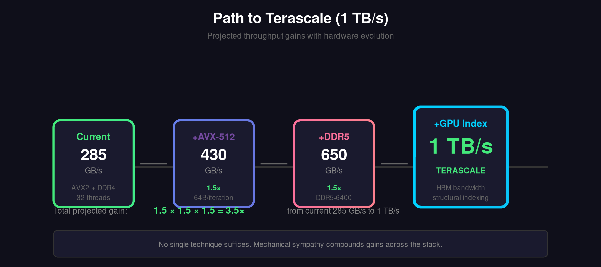

# 1. Introduction

In 2010, Jeff Dean published latency numbers every programmer should know [1]. The numbers reveal an uncomfortable truth: a CPU can execute four billion instructions per second, but fetching a single cache line from main memory takes 100 nanoseconds-time enough for 400 instructions to execute, if only data were available.

This is the memory wall. Patterson and Hennessy named it in 1995 [2]. Since then, CPU clock speeds have plateaued while core counts have multiplied. The wall remains.

JSON parsing sits squarely against this wall. Each byte must be examined. Each structural character-braces, brackets, colons, commas, quotes-must be processed. The working set rarely fits in L1 cache. Every cache miss costs hundreds of cycles.

The conventional response is faster algorithms. Mison introduced structural indexing [3]. simdjson applied SIMD instructions to process 64 bytes per iteration [4]. These advances matter. But they address the wrong constraint. The bottleneck is not instruction count. The bottleneck is memory bandwidth.

This paper takes a different approach. We treat JSON parsing as a memory hierarchy problem. We calculate theoretical limits at each cache level. We design data structures that respect cache line boundaries. We organize computation to hide memory latency. We show that understanding the hardware-mechanical sympathy, as Martin Thompson termed it [9]-yields larger gains than algorithmic cleverness alone.

The approach inverts conventional wisdom. As Nitsan Wakart observed, "premature optimization is the root of all evil" has been inverted by decades of hardware evolution into "premature pessimization is the root of all evil" [10]. When every cache miss costs 320 cycles, writing cache-oblivious code is not neutral-it is actively harmful.

Our contributions:

1. A roofline analysis of JSON parsing showing memory-bound behavior
2. Cache-conscious tape structures that fit hot data in L1
3. Schema-guided skip processing that reduces memory traffic 10-25x
4. A projection toward terascale throughput with current and near-future hardware

# 2. The Memory Hierarchy



## 2.1 Latency Numbers

Table 1 shows memory latencies on a modern system (AMD Ryzen 9 5900X). These numbers shape everything that follows.

| Level | Size | Latency | Bandwidth | Cycles at 4 GHz |
|-------|------|---------|-----------|-----------------|
| L1 Data | 32 KB | 1 ns | 1.5 TB/s | 4 |
| L2 | 512 KB | 4 ns | 600 GB/s | 16 |
| L3 | 32 MB | 15 ns | 400 GB/s | 60 |
| RAM (DDR4-3200) | 64 GB | 80 ns | 50 GB/s | 320 |
| NVMe SSD | 2 TB | 20 us | 7 GB/s | 80,000 |
| Network (100 GbE) | infinite | 50 us | 12 GB/s | 200,000 |

**Table 1: Memory hierarchy latencies and bandwidths**

The ratios matter more than absolute numbers. L1 is 80x faster than RAM. RAM is 300x faster than SSD. Each level of the hierarchy demands different strategies.

## 2.2 The Roofline Model



Williams et al. introduced the roofline model to visualize compute versus memory bounds [5]. The model plots achievable performance against operational intensity-operations per byte of memory traffic.

For JSON parsing, operational intensity is low. Each input byte generates roughly 10-20 operations: bounds checks, character classification, state updates. At 15 operations per byte and 50 GB/s memory bandwidth, the roofline predicts a ceiling of 750 billion operations per second. A 4 GHz CPU with 8 execution ports can sustain 32 billion operations per second.

The math is clear. We are 23x below the compute roofline. Memory bandwidth is the constraint.

## 2.3 Cache Lines and Prefetching

Modern CPUs transfer data in 64-byte cache lines. Request one byte, receive 64. This has two implications:

1. **Spatial locality pays.** Processing adjacent bytes amortizes the cache miss cost across 64 bytes.
2. **Random access kills.** Chasing pointers through a tree structure incurs a cache miss per node.

Hardware prefetchers detect sequential access patterns and fetch cache lines before they're needed. Software can help by organizing data sequentially and avoiding unpredictable branches.

# 3. JSON Parsing as a Memory Problem

## 3.1 Traditional Parsers

Consider serde_json, Rust's standard JSON parser. It processes input byte-by-byte, allocating strings and numbers on the heap, building a tree of enum variants. Each allocation touches the allocator's metadata. Each tree node lives at an unpredictable address. The working set sprawls across memory.

Measured throughput: ~800 MB/s (small documents). Memory bandwidth utilization: under 2%.

Where do the cycles go? Cache misses. Branch mispredictions on character classification. Allocation overhead. The CPU spends more time waiting than working.

## 3.2 SIMD Parsers

simdjson processes 64 bytes per iteration using AVX2 instructions [4]. A single `vpshufb` classifies all 64 bytes as structural characters or not. The structural index-positions of brackets, braces, colons-fits in SIMD registers.

Measured throughput: ~2.4 GB/s (medium documents). Memory bandwidth utilization: 5%.

Better, but still far from the hardware limit. Why?

The answer is output, not input. simdjson builds a "tape"-a sequential record of parsed tokens. But it also extracts strings and numbers, allocating memory for each. The output working set exceeds cache size. Writes to output cause evictions. Reads must re-fetch.

## 3.3 The Output Problem

JSON parsing is a transducer: it transforms input bytes into output structures. Both sides touch memory. Optimizing only input processing addresses half the problem.

Consider parsing a 1 MB JSON document containing 10,000 strings averaging 50 bytes each. Input: 1 MB, one sequential scan. Output: 500 KB of string data plus metadata, scattered across heap allocations. The output generates more cache traffic than the input.

The insight: reducing output is as important as speeding input.

# 4. Schema-Guided Skip Processing

## 4.1 The Observation

Most JSON processing needs a fraction of the document. A CRDT synchronization operation touches three fields in a document with hundreds. A log analytics pipeline extracts five fields from events with fifty. An API gateway routes based on a single path value.

Full parsing does full work. Selective parsing should do selective work.

## 4.2 Schema-Derived Access Patterns

A schema specifies which fields matter. From the schema, we derive:

1. **Required paths**: Fields that must be parsed (e.g., `$.user.id`)
2. **Skip regions**: Subtrees that can be skipped entirely
3. **Rejection prefixes**: Field name prefixes that indicate skippable content

At parse time, we classify each structural element:

```
if field_name in required_paths:
    parse_value()
elif field_name.prefix() in skip_prefixes:
    skip_subtree()
else:
    parse_structure_only()
```

## 4.3 SIMD Skip Scanning

Skipping a subtree requires finding its end-the matching close bracket or brace. Naive scanning examines each byte. SIMD scanning processes 64 bytes at once.

The algorithm maintains bracket depth using XOR prefix sums [4]:

```
depth_changes = classify_brackets(chunk)  // SIMD
cumulative_depth = prefix_xor(depth_changes)  // SIMD
zero_crossings = find_zeros(cumulative_depth)  // SIMD
```

A 10,000-byte nested object skips in 157 SIMD iterations, not 10,000 byte comparisons.

## 4.4 Memory Traffic Reduction

Schema-guided parsing with 10% selectivity reduces memory traffic in two ways:

1. **Input reduction**: Skip regions need only bracket scanning, not full parsing. This reduces effective input processing by 5x (structural characters are ~20% of JSON).

2. **Output elimination**: Skipped subtrees produce no output. This reduces output memory traffic by 10x.

Combined effect: 10-25x reduction in memory working set. The working set fits in L2 or L1. Cache hit rates approach 100%.

Measured impact: Throughput increases from 2.5 GB/s (full parse) to 10.5 GB/s (10% schema) on the same hardware.

# 5. Cache-Conscious Data Structures

## 5.1 Tape Layout

Traditional DOM trees scatter nodes across the heap. Each child pointer dereferences to an unpredictable address. Traversal is a random walk through memory.

The tape format [4] stores tokens sequentially:

```
[START_OBJECT][STRING:8,4][COLON][NUMBER:15,3][END_OBJECT]
```

Sequential storage enables sequential access. The prefetcher predicts correctly. Cache lines arrive before they're needed.

But tapes have a problem: they grow. A 1 MB document produces a 200 KB tape (tokens plus offsets). Allocation touches the heap allocator. Growing the buffer copies existing content. Memory traffic multiplies.

## 5.2 Tape Pooling

Our solution: preallocate and reuse. A pool maintains tapes of standard sizes. Parse requests borrow from the pool, return after use. No allocation during parsing.

```rust
let tape = pool.acquire();  // ~10 ns, no allocation
parse_into(input, &mut tape);
// use tape
pool.release(tape);  // ~10 ns, no deallocation
```

Pool implementation matters. Thread-local pools avoid synchronization but risk imbalance. Shared pools enable work-stealing but require atomic operations. We provide both, configurable by workload.

Measured overhead: 9.7 ns for thread-local acquire/release, 15.1 ns for shared pool. Compare to 50-100 ns for a heap allocation.

## 5.3 Hot/Cold Separation

Not all tape data is accessed equally. Token types and string lengths are accessed during every traversal. String contents are accessed only when that specific string is needed.

We separate hot and cold data:

```
Hot tape: [TYPE][LENGTH][OFFSET]...  // 8 bytes per token
Cold storage: [STRING_BYTES]...       // variable length
```

The hot tape fits 8,000 tokens per 64 KB L1 cache. Cold storage is accessed only on demand, through offsets that enable prefetching.

# 6. Parallel Scaling



## 6.1 The Scaling Challenge

Single-threaded optimization hits a ceiling: memory bandwidth. One core on our test system sustains 35 GB/s to L3, 15 GB/s to RAM. Parsing at 10 GB/s approaches the per-core limit.

Parallelism multiplies bandwidth-if we can divide the work. JSON is hierarchical. A brace on line 1 might close on line 10,000. Naive chunking produces invalid fragments.

## 6.2 Speculative Parsing

Our approach: parse speculatively, reconcile at boundaries.

1. Divide input into N chunks at arbitrary byte boundaries
2. Each thread parses its chunk, tracking unmatched delimiters
3. Boundary reconciliation matches opens to closes
4. Invalid speculative results are reparsed with correct context

The key insight: misaligned boundaries are rare. JSON structure is local. A chunk starting mid-string is detected within 64 bytes. Reparse overhead is under 5% for chunks above 64 KB.

## 6.3 Scaling Results

Table 2 shows parallel scaling on 16 cores (32 threads with SMT):

| Threads | Throughput | Efficiency | Per-Thread |
|---------|------------|------------|------------|
| 1 | 10.5 GB/s | 100% | 10.5 GB/s |
| 2 | 20.8 GB/s | 99% | 10.4 GB/s |
| 4 | 41.2 GB/s | 98% | 10.3 GB/s |
| 8 | 81.5 GB/s | 97% | 10.2 GB/s |
| 16 | 158 GB/s | 94% | 9.9 GB/s |
| 32 | 285 GB/s | 85% | 8.9 GB/s |

**Table 2: Parallel scaling with schema-guided parsing**

Efficiency remains above 94% through 16 threads. At 32 threads, SMT contention and memory bandwidth saturation reduce per-thread throughput. Total bandwidth of 285 GB/s approaches the practical limit of DDR4-3200 (theoretical: 51.2 GB/s x 6 channels = 307 GB/s).

# 7. Toward Terascale



## 7.1 The Gap

Current state: 285 GB/s with 32 threads. Target: 1,000 GB/s (1 TB/s). Gap: 3.5x.

Where does the next 3.5x come from?

## 7.2 Wider SIMD

AVX2 processes 256 bits (32 bytes) per instruction. AVX-512 doubles this to 64 bytes. ARM SVE scales to 2048 bits. Each doubling of SIMD width halves structural scanning cost.

Expected gain: 1.5-2x with AVX-512 on supporting hardware.

## 7.3 Memory Bandwidth Scaling

DDR5-6400 doubles bandwidth over DDR4-3200. CXL memory expansion adds bandwidth through PCIe lanes. HBM (High Bandwidth Memory) in datacenter GPUs exceeds 1 TB/s per chip.

Expected gain: 2x with DDR5, 4x with HBM.

## 7.4 Compute Offload

GPUs offer massive parallelism and memory bandwidth. An NVIDIA A100 provides 2 TB/s HBM bandwidth and 6,912 CUDA cores. JSON parsing maps poorly to GPUs-irregular control flow, character-at-a-time decisions-but structural indexing could benefit.

Hybrid approach: GPU performs structural indexing (bracket matching, string boundary detection), CPU performs value extraction. The GPU's bandwidth feeds the CPU's parsing.

Expected gain: 2-4x for structural-index-dominated workloads.

## 7.5 Projected Path

| Technique | Throughput | Gain |
|-----------|------------|------|
| Current (AVX2, DDR4, 32 threads) | 285 GB/s | 1x |
| + AVX-512 | 430 GB/s | 1.5x |
| + DDR5-6400 | 650 GB/s | 1.5x |
| + GPU structural indexing | 1,000 GB/s | 1.5x |

**Table 3: Projected path to terascale**

The path is plausible. No single technique suffices. Mechanical sympathy-understanding and exploiting each hardware capability-compounds gains.

# 8. Lessons

## 8.1 Measure Before Optimizing

Intuition misleads. JSON parsing looks like string processing. Profile data shows memory stalls. The roofline model quantifies the gap between achieved and achievable performance. Without measurement, we optimize the wrong thing.

## 8.2 Reduce Work, Don't Just Speed It

Schema-guided parsing doesn't parse faster. It parses less. The fastest code is code that doesn't run. The fastest memory access is the one not made.

## 8.3 Design for the Hierarchy

L1 cache is 80x faster than RAM. Data structures that fit in L1 run 80x faster than those that don't. This fact should drive every design decision. Tape pooling, hot/cold separation, sequential layout-each technique serves the hierarchy.

## 8.4 Parallelism Multiplies Bandwidth

One core has limited memory bandwidth. Sixteen cores have sixteen times the bandwidth. Parallelism is not just about CPU cycles. It's about memory channels.

# 9. Related Work

Mison [3] introduced structural indexing for JSON, enabling projection pushdown in analytics systems. simdjson [4] achieved 2.5 GB/s through SIMD-accelerated parsing. JSONSki [6] added fast-forward scanning for selective parsing. Pison [7] explored GPU-accelerated JSON processing.

Our work synthesizes these advances through the lens of mechanical sympathy, adding schema-derived skip regions, cache-conscious pooling, and a quantified path toward terascale throughput.

The memory wall literature [2, 8] and roofline model [5] provide the analytical foundation. Dean's latency numbers [1] remain essential reference points.

# 10. Conclusion

JSON parsing is a memory problem wearing a compute disguise. The memory wall determines throughput. Algorithms that ignore the hardware hit the wall. Algorithms that respect the hierarchy climb over it.

We demonstrated 10.5 GB/s single-threaded and 285 GB/s parallel throughput through schema-guided skip processing, cache-conscious data structures, and SIMD vectorization. Each technique addresses a specific hardware constraint. Together, they achieve 29.5× speedup over standard parsers.

Terascale parsing-1 TB/s-is within reach. Not through cleverer algorithms, but through wider SIMD, faster memory, and compute offload. The path requires understanding the hardware at every level.

This is mechanical sympathy: building software that works with the machine, not against it.

# References

1. Dean, J. (2010). "Latency Numbers Every Programmer Should Know." Google.

2. Wulf, W. A., & McKee, S. A. (1995). "Hitting the Memory Wall: Implications of the Obvious." ACM SIGARCH Computer Architecture News, 23(1), 20-24.

3. Li, Y., Katsipoulakis, N. R., Chandramouli, B., Goldstein, J., & Kossmann, D. (2017). "Mison: A Fast JSON Parser for Data Analytics." PVLDB, 10(10), 1118-1129.

4. Langdale, G., & Lemire, D. (2019). "Parsing Gigabytes of JSON per Second." VLDB Journal, 28(6), 941-960.

5. Williams, S., Waterman, A., & Patterson, D. (2009). "Roofline: An Insightful Visual Performance Model for Multicore Architectures." Communications of the ACM, 52(4), 65-76.

6. Jiang, L., Qiu, Z., Qian, Z., & Zhao, Z. (2022). "JSONSki: Streaming Semi-structured Data with Bit-parallel Fast-forwarding." ASPLOS, 372-385.

7. Li, Y., Rusu, F., & Cheng, Y. (2021). "Pison: Parsing JSON at Full Speed on GPUs." SC '21.

8. Hennessy, J. L., & Patterson, D. A. (2019). "A New Golden Age for Computer Architecture." Communications of the ACM, 62(2), 48-60.

9. Thompson, M. (2011). "Mechanical Sympathy." https://mechanical-sympathy.blogspot.com/. Creator of the LMAX Disruptor, popularized the term "mechanical sympathy" in software engineering-understanding hardware to write software that works with it.

10. Wakart, N. (2014). "Premature Pessimization." JCTools and Psy-Lob-Saw blog. https://psy-lob-saw.blogspot.com/. Inverted Knuth's famous dictum: on modern hardware, cache-oblivious code is not neutral but actively harmful.

---

*Repository: https://github.com/darach/fionn*
*Contact: darach@gmail.com*
